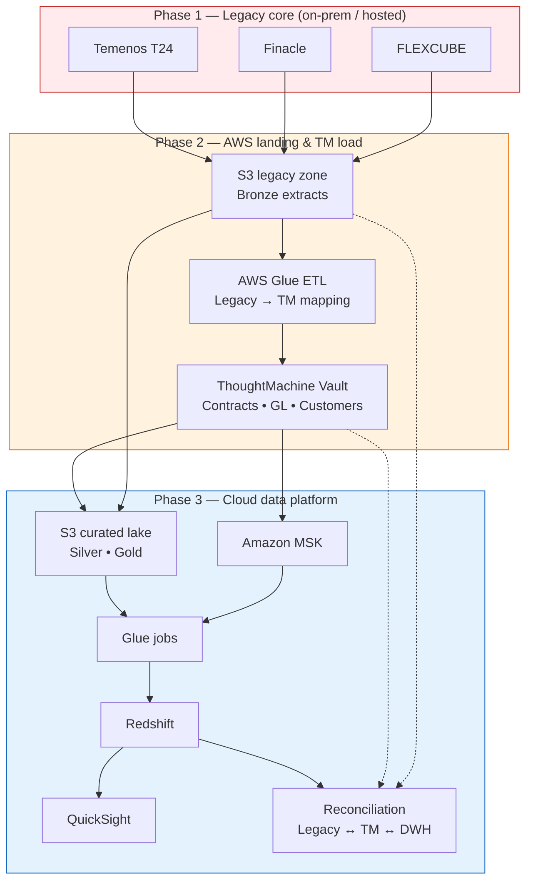

# GFT Cloud Data Migration Framework

> **GFT** implements **ThoughtMachine Vault** for **APAC banks** replacing legacy cores. Migration is **two-stage**: legacy core → **S3** + **TM mapping ETL** → **ThoughtMachine** go-live data; then **AWS** (Glue, Redshift, MSK, QuickSight) for analytics, reconciliation, and parallel run.

## End-to-end flow (what GFT actually delivers)

| Phase | What happens | Outcome |
|-------|----------------|--------|
| **1. Legacy extract** | Bank’s **legacy core** (e.g. **Temenos T24**, **Finacle**, **Oracle FLEXCUBE**) exports GL, contracts, customers, balances to **S3** landing | Raw legacy zone on AWS (`s3://…/legacy/`) |
| **2. TM mapping & load** | **Glue** (or batch jobs) transform legacy → **ThoughtMachine Vault schema**; apply GFT mapping packs; load via TM bulk/API | TM vault populated — accounts, contracts, postings usable in TM features |
| **3. AWS analytics & cutover** | TM **API/CDC** + legacy S3 feeds → medallion lake → **Redshift**; **MSK** for events; **QuickSight** for sign-off | Parity reports, reconciliation, decommission legacy |

ThoughtMachine is **not** the first hop from the old core. Legacy data lands on S3 first; only after mapping/load does TM hold production-shaped core banking data.

## Legacy source systems (typical APAC programs)

| Core | Vendor / style | Typical extract |
|------|----------------|-----------------|
| **Temenos T24** | Transact / T24 | COB tables, AA contracts, customer, GL entries |
| **Finacle** | Oracle / Infosys | CIF, accounts, transactions, GL |
| **FLEXCUBE** | Oracle | Customer, account, collateral, GL |

Banks often run **one** primary legacy during migration; GFT programs standardize extracts into a common S3 layout before TM-specific mapping.

## Overview

Production-style toolkit covering:

- **Legacy → S3**: Connectors and batch extract patterns for T24 / Finacle / Flexcube-style schemas
- **S3 → ThoughtMachine**: Mapping specs (customer, contract, balance, posting), validation, load orchestration
- **ThoughtMachine → AWS lake**: Post-go-live CDC/API to bronze/silver/gold
- **AWS**: S3 zones, **Glue**, **Redshift**, **MSK**, **QuickSight**
- **Controls**: Row-count reconciliation (legacy vs TM vs warehouse), checksums, audit lineage

## Architecture



## AWS data stack

| Service | Role |
|---------|------|
| **S3** | Legacy landing + medallion zones; Parquet; partition by business date / source system |
| **Glue** | Legacy→TM transforms; crawlers; ongoing lake ETL |
| **Redshift** | Migration warehouse; GL facts; parity vs legacy |
| **MSK** | CDC / payment events after TM go-live |
| **QuickSight** | Cutover dashboards, recon sign-off |
| **IAM / KMS** | Least privilege; encryption at rest |

## Key features

| Feature | Description |
|---------|-------------|
| **Legacy extractors** | Patterns for T24 / Finacle / Flexcube table families → S3 |
| **TM mapping packs** | Field-level maps into Vault customer, contract, balance, posting models |
| **TM load orchestration** | Validate → stage → bulk load / API ingest into ThoughtMachine |
| **Post-TM AWS pipeline** | Glue, Redshift, MSK as in standard GFT TM programs |
| **Reconciliation** | Legacy S3 row counts vs TM vault vs Redshift marts |
| **GFT delivery** | Repeatable accelerators for APAC ThoughtMachine implementations |

## Project layout

```
├── connector_base.py      # Source connectors (legacy DB / files)
├── extractor.py             # Full / batch table extract → S3
├── validator.py             # Row-count & schema checks
├── docs/
│   └── migration_phases.md  # Phase 1–3 detail & mapping examples
├── infra/                   # Glue, Redshift, MSK stubs (as added)
└── dags/                    # Orchestration
```

## Quick start

```bash
git clone https://github.com/willtran112358/gft-cloud-data-migration-framework.git
cd gft-cloud-data-migration-framework
python -m venv .venv
source venv/bin/activate   # Windows: venv\Scripts\activate
pip install -r requirements.txt
pytest tests/ -q
```

See [docs/migration_phases.md](docs/migration_phases.md) for legacy→TM mapping examples.

---

**Portfolio reconstruction** — no GFT, ThoughtMachine, or bank customer data included.

**Will Tran** — [@willtran112358](https://github.com/willtran112358)
