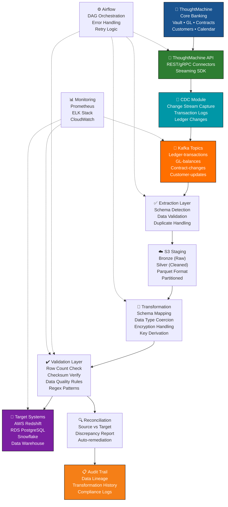

# ThoughtMachine Banking Data Integration Platform

Enterprise data migration and ETL platform for ThoughtMachine Core Banking systems with cryptographic ledger support, change data capture, and regulatory compliance.

## Overview

Production-grade data integration platform for ThoughtMachine Core Banking migrations and analytics:
- **Source System**: ThoughtMachine Core Banking (Cryptography Module, General Ledger, Contracts, Customers)
- **Target Systems**: AWS (Redshift, RDS), Snowflake, Data Warehouse, Analytics Databases
- **Key Capabilities**: Schema detection, CDC streaming, data validation, reconciliation, lineage tracking
- **Use Cases**: Core system migrations, data lake ingestion, analytics warehouse builds, regulatory reporting

## Architecture



## Key Features

| Feature | Description |
|---------|-------------|
| **ThoughtMachine Integration** | Direct API integration with Core Banking GL, cryptography, contracts |
| **CDC Streaming** | Real-time change capture with Kafka topics for ledger transactions |
| **Schema Auto-Detection** | Automatic discovery of GL account hierarchy, contract structure |
| **Data Transformation** | GL account mapping, encrypted field handling, format conversion |
| **Validation Framework** | Row count reconciliation, checksum verification, business rules |
| **Multi-Target Support** | AWS Redshift, RDS, Snowflake, custom data warehouses |
| **Audit & Lineage** | Complete data provenance, transformation history, compliance logs |
| **Error Recovery** | Retry logic, dead-letter queues, manual intervention workflows |
| **Performance** | Parallel extraction, batching (10K+ rows/sec), connection pooling |

## Quick Start

```bash
git clone https://github.com/willtran112358/thoughtmachine-data-migration.git
cd thoughtmachine-data-migration

# Setup environment
python -m venv venv
source venv/bin/activate
pip install -r requirements.txt

# Configure
cp .env.example .env
# Edit .env with TM_API credentials and target DB

# Run migration
python src/migrate.py --source thoughtmachine --target redshift

# Or use Airflow
airflow dags trigger thoughtmachine_bank_etl
```

## Testing

```bash
pytest tests/unit -v
pytest tests/integration --markers integration
```

## Contributing

1. Create feature branch
2. Add tests (85%+ coverage)
3. Submit PR

## License

MIT License

## Author

**WillTran** — [@willtran112358](https://github.com/willtran112358)