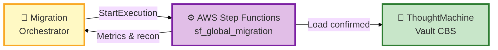
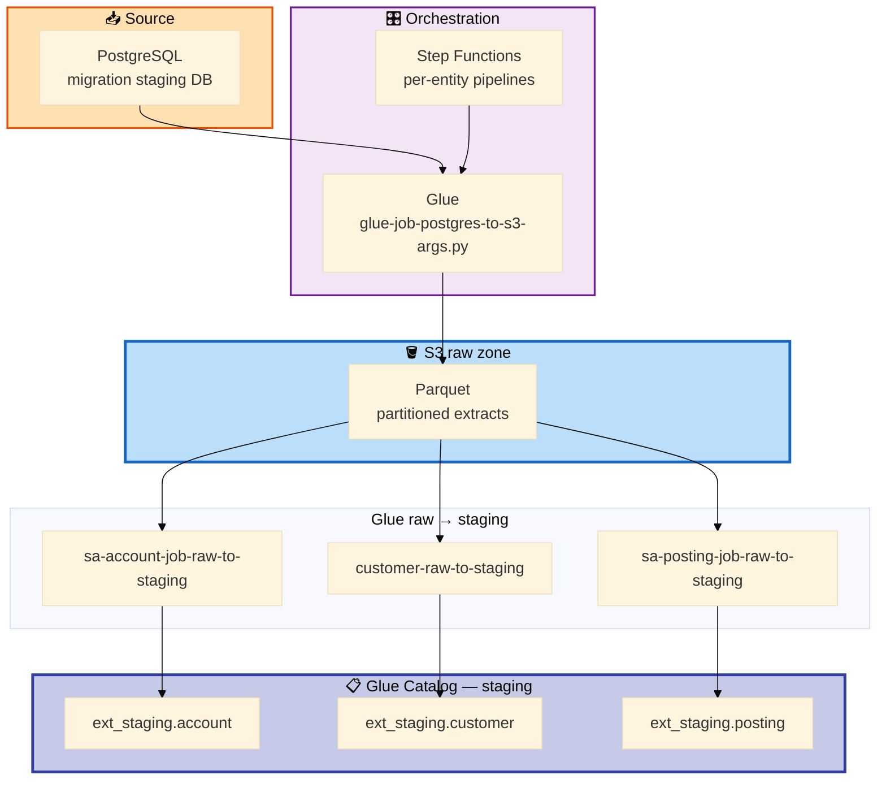
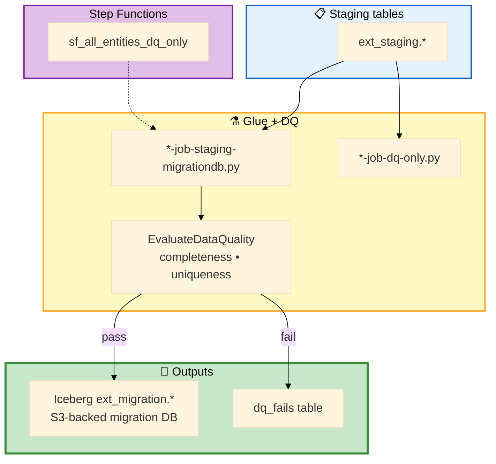
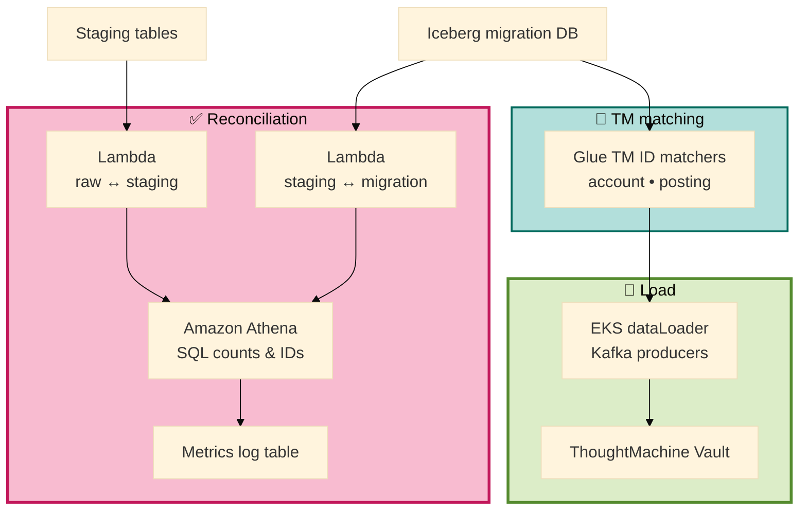
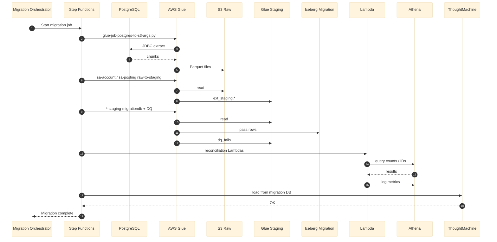

# GFT Cloud Data Migration Framework

> **GFT** implements **ThoughtMachine Vault** for **APAC banks** replacing legacy cores (**T24**, **Finacle**, **FLEXCUBE**). This repo includes the **portfolio Python toolkit** (`extractor`, `validator`) and the **`data-migration-infra-main`** snapshot: production-style **AWS Step Functions**, **Glue**, **Iceberg**, **Athena**, **Lambda**, and **EKS** producers used on a live migration program.

**Portfolio reconstruction** — no GFT, ThoughtMachine, or bank customer data. UAT resource names in Glue scripts are placeholders.

## What’s in this repo

| Area | Location | Role |
|------|----------|------|
| **Infra (Terraform)** | `data-migration-infra-main/infra/` | VPC, S3 raw/staging, Glue jobs, Step Functions, Lambda recon |
| **Glue / Lambda ETL** | `data-migration-infra-main/infra/data-etl/python/` | Extract, raw→staging, staging→migration+DQ |
| **TM load (K8s)** | `data-migration-infra-main/backend/dataLoader/` | Kafka producers after migration DB validated |
| **Python toolkit** | `extractor.py`, `validator.py`, `connector_base.py` | Legacy→S3 extract & validation patterns |
| **Pipeline map** | [docs/gft_migration_pipeline.md](docs/gft_migration_pipeline.md) | Script names ↔ migration phases |

## End-to-end flow (GFT delivery)

| Phase | What happens | Outcome |
|-------|----------------|--------|
| **1. Extract** | **PostgreSQL** (migration staging DB) → Glue `glue-job-postgres-to-s3-args.py` → **S3 raw** Parquet | Authoritative snapshots per table |
| **2. Raw → staging** | Glue `sa-*`, `ca-*`, `customer-*`, `loan-*` raw-to-staging jobs → **Glue Catalog** `ext_staging.*` | Conformed account, posting, customer, deposit, loan |
| **3. Staging → migration + DQ** | `*-job-staging-migrationdb.py` + Glue DQ; fails → `dq_fails`; pass → **Iceberg** `ext_migration.*` | TM-ready migration tables |
| **4. Reconciliation** | Lambda + **Athena** compare raw / staging / migration; `sf_global_reconciliation` | Sign-off metrics in log tables |
| **5. ThoughtMachine load** | TM ID matchers + **EKS** Kafka producers → **ThoughtMachine Vault** | Migration complete |

Legacy cores land in PostgreSQL (or S3) first; **ThoughtMachine** is the target after the migration DB passes DQ and recon — then AWS analytics (Redshift / QuickSight) can run in parallel.

## Architecture diagrams

### 1 · Program overview



### 2 · Phase 1–2 — Extract & raw → staging



### 3 · Phase 3 — Staging → migration + data quality



### 4 · Phase 4–5 — Reconciliation & ThoughtMachine load



### 5 · Sequence view (matches PlantUML)



## Legacy cores → AWS (bank context)

| Core | Typical role in program |
|------|-------------------------|
| **Temenos T24** | COB tables, AA contracts, GL |
| **Finacle** | CIF, accounts, transactions |
| **FLEXCUBE** | Customer, account, collateral |

Extracts are normalized into the **migration PostgreSQL / S3 raw** layout before TM mapping — see [docs/migration_phases.md](docs/migration_phases.md).

## AWS stack

| Service | Role in `data-migration-infra-main` |
|---------|-------------------------------------|
| **Step Functions** | `sf_global_migration`, per-entity `*_raw_to_migration`, DQ, recon |
| **Glue** | JDBC extract, Spark transforms, Glue DQ, Iceberg writes |
| **S3** | Raw + staging warehouse paths |
| **Glue Catalog** | `ext_staging`, `ext_migration`, `dq_fails` |
| **Iceberg** | Migration DB tables on S3 |
| **Lambda + Athena** | Reconciliation & metrics |
| **EKS** | dataLoader producers to ThoughtMachine |
| **Terraform** | `infra/data-etl`, `networking`, `eks` |

## Project layout

```
gft-cloud-data-migration-framework/
├── data-migration-infra-main/     # Terraform + Glue + SF + backend (GFT program)
│   ├── infra/data-etl/python/    # Glue & Lambda scripts
│   └── backend/dataLoader/        # TM Kafka producers
├── connector_base.py
├── extractor.py
├── validator.py
└── docs/
    ├── migration_phases.md        # Legacy → TM → AWS phases
    └── gft_migration_pipeline.md  # Script ↔ layer map
```

## Quick start

```bash
git clone https://github.com/willtran112358/gft-cloud-data-migration-framework.git
cd gft-cloud-data-migration-framework
python -m venv .venv
# Windows
.venv\Scripts\activate
pip install -r requirements.txt
```

Explore infra: `cd data-migration-infra-main/infra/data-etl && type README.md`

---

**Will Tran** — [@willtran112358](https://github.com/willtran112358)
