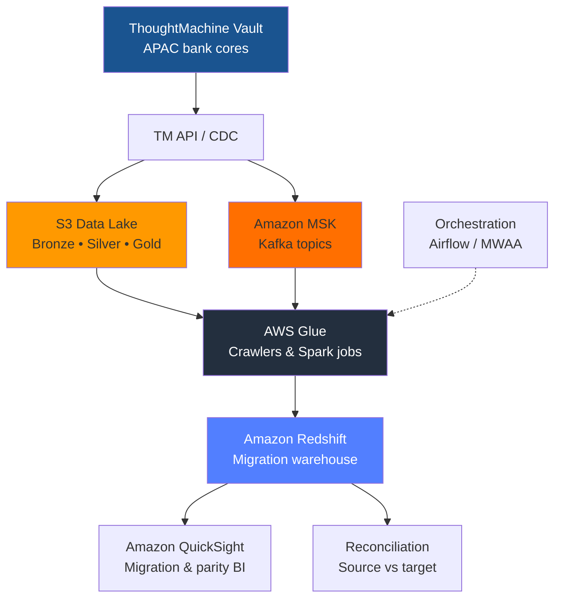

# GFT Cloud Data Migration Framework

> **GFT** implements **ThoughtMachine Vault** core banking for **APAC banks** migrating from legacy cores. This framework covers **AWS cloud data** patterns: **Glue**, **Redshift**, **Amazon MSK (Kafka)**, **S3** data lake zones, and **QuickSight** BI for migration cutover and parallel run.

## Overview

Production-style migration toolkit for:

- **Source**: ThoughtMachine Core Banking (ledger, contracts, customers, calendar)
- **AWS landing**: S3 bronze/silver/gold, Glue catalog & ETL jobs
- **Streaming**: MSK topics for CDC-style ledger and payment events
- **Warehouse**: Redshift (and optional RDS) for analytics & reconciliation
- **BI**: QuickSight datasets for migration dashboards and sign-off packs
- **Controls**: Row-count reconciliation, checksum validation, audit lineage

## Architecture



## AWS Data Stack

| Service | Role |
|---------|------|
| **S3** | Raw & curated zones, Parquet, partition by business date |
| **Glue** | Schema discovery, Spark transforms, job bookmarks |
| **Redshift** | Migration warehouse, SORTKEY/DISTKEY for GL facts |
| **MSK** | High-volume CDC / event streaming |
| **QuickSight** | Executive & ops dashboards for cutover |
| **IAM / KMS** | Least-privilege roles, encryption at rest |

## Key Features

| Feature | Description |
|---------|-------------|
| **ThoughtMachine connectors** | GL, contracts, customer vault API patterns |
| **Legacy-to-cloud mapping** | Schema maps for traditional core decommission |
| **Validation framework** | Row counts, checksums, business-rule tests |
| **GFT delivery model** | Repeatable accelerators for APAC TM programs |

## Quick Start

```bash
git clone https://github.com/willtran112358/gft-cloud-data-migration-framework.git
cd gft-cloud-data-migration-framework
python -m venv .venv
source .venv/bin/activate   # Windows: venv\Scripts\activate
pip install -r requirements.txt
pytest tests/ -q
```

## Project Layout

```
├── src/integrations/     # ThoughtMachine & file connectors
├── src/jobs/             # Bronze / silver / gold jobs
├── infra/terraform/      # AWS Glue, Redshift, MSK stubs
├── dags/                 # Orchestration
└── docs/                 # Migration runbooks
```

---

**Portfolio reconstruction** — no GFT or bank customer data included.

**Will Tran** — [@willtran112358](https://github.com/willtran112358)
