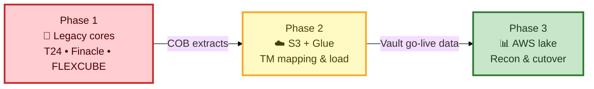
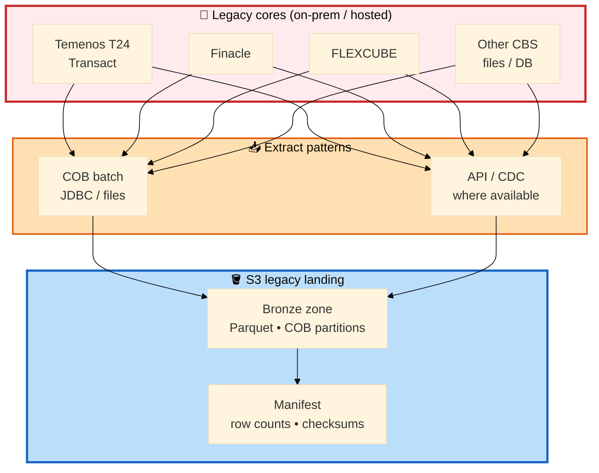
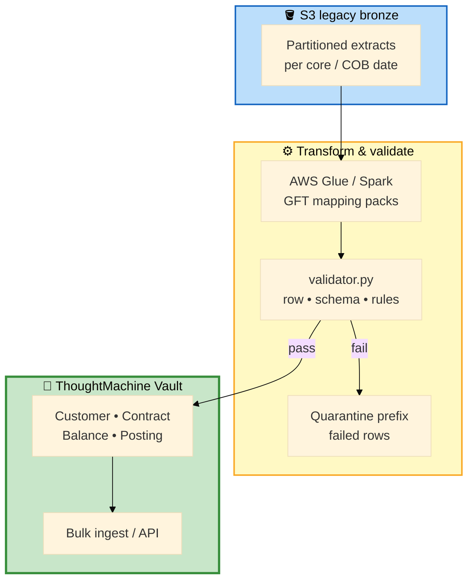
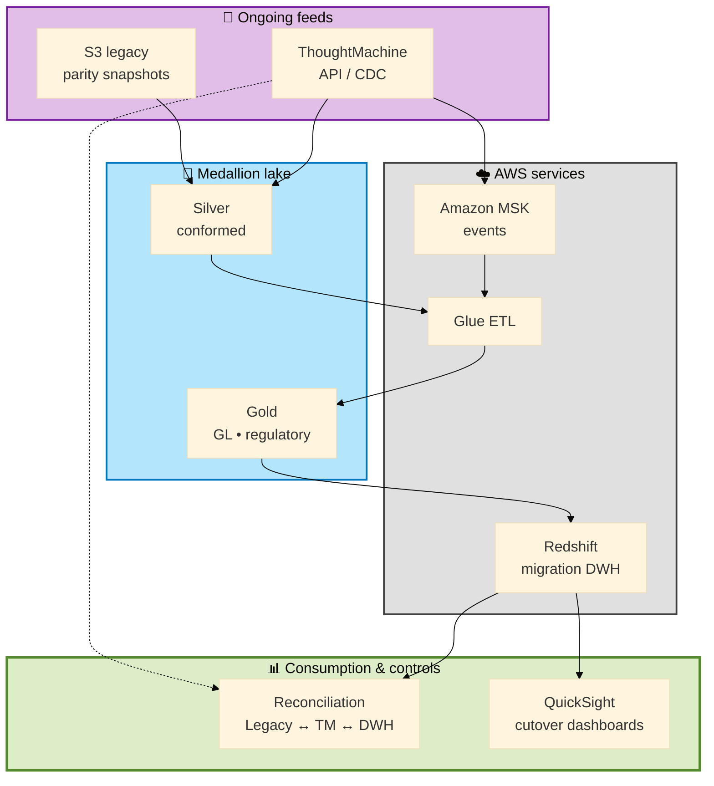

# GFT Cloud Data Migration Framework

> **GFT** delivers **ThoughtMachine Vault** programs for **APAC banks** replacing legacy cores. The **reference architecture** below is the industry pattern GFT uses across the region: **legacy extract → S3 landing → TM mapping & load → AWS analytics & cutover**. The folder `data-migration-infra-main/` is one **program implementation** (Glue, Step Functions, Iceberg) — useful as a code sample, not the only valid design for every APAC bank.

**Portfolio reconstruction** — no GFT, ThoughtMachine, or customer data.

## End-to-end flow (APAC standard)

| Phase | What happens | Outcome |
|-------|----------------|--------|
| **1. Legacy extract** | Bank **legacy core** exports GL, contracts, customers, balances to **S3** landing (COB / batch) | Raw legacy zone (`s3://…/legacy/`) |
| **2. TM mapping & load** | **Glue** (or batch) transforms legacy → **ThoughtMachine Vault** schema; GFT mapping packs; bulk/API load | Vault populated — accounts, contracts, postings |
| **3. AWS analytics & cutover** | TM **API/CDC** + legacy S3 → medallion lake → **Redshift**; **MSK** events; **QuickSight** sign-off | Parity reports, reconciliation, legacy decommission |

ThoughtMachine is **not** the first hop from the old core. Legacy lands on **S3** first; only after mapping/load does Vault hold production-shaped CBS data.

## APAC legacy core banking (typical sources)

| Core | Vendor / footprint | Typical extract entities |
|------|-------------------|---------------------------|
| **Temenos T24 / Transact** | Widely used AU, NZ, SEA, India | `CUSTOMER`, AA arrangements, `STMT_ENTRY`, GL, COB snapshots |
| **Finacle** | Infosys — common India, PH, MY, VN partners | CIF, account master, transactions, GL |
| **Oracle FLEXCUBE** | Universal banking, Islamic variants | Customer, account, collateral, GL |
| **Temenos Triple A / Wealth** | Wealth-heavy APAC programs | Portfolio, positions (alongside T24) |
| **Finastra / Misys** | Selected AU & regional installs | Lending, treasury feeds |
| **In-house / vendor CBS** | Smaller regional banks | File-based COB exports → same S3 contract |

Banks usually migrate **one** primary core per program. GFT standardizes extracts into a **common S3 layout** (partition by COB date, source system, entity) before **ThoughtMachine-specific** mapping.

> **Note:** `data-migration-infra-main/` uses a **PostgreSQL staging DB + Iceberg migration layer** pattern from a **single European-program** snapshot. APAC programs (e.g. T24 COB → S3 directly) often **skip** that hop — see [docs/gft_migration_pipeline.md](docs/gft_migration_pipeline.md) for script-level detail only.

## Architecture diagrams

### 1 · Three-phase program (overview)



### 2 · Phase 1 — Legacy extract to S3



### 3 · Phase 2 — S3 → ThoughtMachine Vault



### 4 · Phase 3 — AWS data platform & cutover



## AWS data stack (Phase 3)

| Service | Role |
|---------|------|
| **S3** | Legacy landing + medallion zones; Parquet; partition by COB / source |
| **Glue** | Legacy→TM transforms; crawlers; ongoing lake ETL |
| **Redshift** | Migration warehouse; GL facts; parity vs legacy |
| **MSK** | CDC / payment events after TM go-live |
| **QuickSight** | Cutover dashboards, recon sign-off |
| **IAM / KMS** | Least privilege; encryption at rest |

_Optional on specific programs:_ Step Functions, Iceberg migration DB, Athena recon — see `data-migration-infra-main/`._

## Key features (this repo)

| Feature | Location |
|---------|----------|
| **Legacy extractors** | `extractor.py`, `connector_base.py` — T24 / Finacle / Flexcube-style patterns |
| **Validation** | `validator.py` — row counts, schema checks |
| **TM mapping packs** | Documented in [docs/migration_phases.md](docs/migration_phases.md) |
| **Reference infra** | `data-migration-infra-main/` — Glue, Step Functions, Lambda (one program) |
| **Pipeline script map** | [docs/gft_migration_pipeline.md](docs/gft_migration_pipeline.md) |

## Project layout

```
gft-cloud-data-migration-framework/
├── connector_base.py
├── extractor.py
├── validator.py
├── data-migration-infra-main/   # Optional: Terraform + Glue reference (one program)
└── docs/
    ├── migration_phases.md
    └── gft_migration_pipeline.md
```

## Quick start

```bash
git clone https://github.com/willtran112358/gft-cloud-data-migration-framework.git
cd gft-cloud-data-migration-framework
python -m venv .venv
.venv\Scripts\activate          # Windows
pip install -r requirements.txt
```

See [docs/migration_phases.md](docs/migration_phases.md) for legacy→TM mapping examples.

---

**Will Tran** — [@willtran112358](https://github.com/willtran112358)
